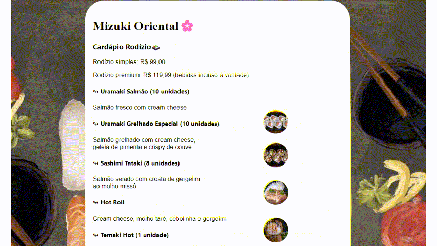

# cardapioweb

# Índice

* [Descrição](#descri%C3%A7%C3%A3o)
* [introdução](#introdu%C3%A7%C3%A3o)
* [Funcionalidades](#funcionalidades)
* [Tecnologias utilizadas](#tecnologias-utilizadas)
 
## Descrição
 * O projeto tem o objetivo de proporcionar uma experiência intuitiva e prática para os clientes que desejam visualizar os itens disponíveis em nosso estabelecimento.

## Introdução
* O cardápio Web permite que o usuário encontre facilmente os pratos, bebidas e opções disponíveis, além de oferecer informações detalhadas sobre cada item.

## Funcionalidades
* Exibir habilidades e estilo de trabalho

## Tecnologias Utilizadas
* HTML, CSS e Google

## Resultado

### Autor: Manuela Araujo dos Santos 